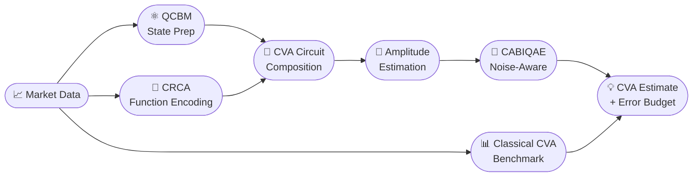

<div align="center">

<br/>

<h1>⟨ Quantum-CVA ⟩</h1>

<p>
  <strong>Research software for quantum Credit Valuation Adjustment, multi-asset CVA pricing,<br/>
  quantum state preparation, controlled function encoding, amplitude estimation,<br/>
  noisy simulation, and hardware-aware experimentation.</strong>
</p>

<p><em>Master's Thesis · Quantitative Banking and Finance · Universitat de València</em></p>

<br/>

<p>
  <a href="#-project-overview"></a>
  <a href="#-source-code-srcquantum_cva"></a>
  <a href="#-6q-cva-ae-experiments"></a>
  <a href="#amplitude-estimation-and-cabiqae"></a>
  <a href="#%EF%B8%8F-execution-notes"></a>
</p>

<br/>

<table>
  <tr>
    <td align="center">⬡&nbsp;&nbsp;<strong>6 qubits</strong><br/><sub>thesis instance</sub></td>
    <td align="center">⊗&nbsp;&nbsp;<strong>2 assets</strong><br/><sub>multi-asset netting set</sub></td>
    <td align="center">∿&nbsp;&nbsp;<strong>3 algorithms</strong><br/><sub>BAE · BIQAE · CABIQAE</sub></td>
    <td align="center">⬡&nbsp;&nbsp;<strong>IBM Heron r2</strong><br/><sub>target hardware</sub></td>
    <td align="center">∞&nbsp;&nbsp;<strong>noise-aware</strong><br/><sub>contrast decay model</sub></td>
  </tr>
</table>

<br/>

<code>classical CVA</code> &nbsp;·&nbsp; <code>QCBM</code> &nbsp;·&nbsp; <code>CRCA</code> &nbsp;·&nbsp; <code>amplitude estimation</code> &nbsp;·&nbsp; <code>noise-aware inference</code> &nbsp;·&nbsp; <code>hardware replay</code>

</div>

---

## 🔬 Pipeline Architecture

The full quantum CVA pipeline proceeds from market data through classical benchmarking, quantum training, circuit composition, and amplitude estimation to a final CVA estimate with explicit error accounting.



---

## 🗺️ Research Map

| Layer | Public surface | Purpose |
|:---|:---|:---|
| **Reusable package** | `src/quantum_cva/` | Core implementation layer for classical pricing, quantum circuits, amplitude estimation, runners, and utilities. |
| **Thesis pipeline** | `cva_pricing_pipeline/multi_asset/6q_instance` | End-to-end 6q multi-asset CVA instance developed for the master's. |
| **Quantum training** | `training_multi_asset/` | QCBM state preparation, CRCA function encoders, statevector-vs-shots comparisons, and topology studies. |
| **AE experiments** | `quantum/ae_cva/` | Noiseless, noisy, replay, and hardware-oriented amplitude-estimation workflows. |
| **Method toys** | `toys/amplitude_estimation_experiments` | Focused AE studies for ideal, noise-aware, and hardware-replay regimes. |
| **Publication figures** | `plots/` | Final AE/CVA plotting layer for summaries, error budgets, and contrast diagnostics. |

---

## 📋 Contents

<table>
<tr>
<td valign="top">

**Core**
- [Project Overview](#-project-overview)
- [Repository Structure](#-repository-structure)
- [Source Code: `src/quantum_cva`](#-source-code-srcquantum_cva)

</td>
<td valign="top">

**Experiments**
- [Single Asset and Multi Asset](#%EF%B8%8F-single-asset-and-multi-asset)
- [6q CVA AE Experiments](#-6q-cva-ae-experiments)
- [Toys](#-toys)

</td>
<td valign="top">

**Reference**
- [Plots](#-plots)
- [Data and References](#-data-and-references)
- [Execution Notes](#%EF%B8%8F-execution-notes)

</td>
</tr>
</table>

---

## 🔭 Project Overview

<details open>
<summary><strong>Repository mission and central contribution</strong></summary>

<br/>

Quantum-CVA is a research repository for quantum Credit Valuation Adjustment (CVA), originally developed as part of a master's thesis in [Quantitative Finance and Banking](https://www.uv.es/uvweb/master-banca-finanzas-cuantitatives/es/master-banca-finanzas-cuantitatives-1285879375883.html). It combines classical portfolio CVA pricing, market-data-driven discretisation, quantum state preparation, controlled function encoding, amplitude estimation, noisy simulation, and selected hardware-oriented experiments.

The central software contribution is the reusable source package in `src/quantum_cva`. The repository is not a collection of isolated notebooks: it contains a public end-to-end quantum CVA pipeline that builds the classical benchmark, trains the quantum state and function encoders, composes the CVA circuit, and runs amplitude-estimation experiments with explicit accounting of queries, noise, calibration, and hardware constraints.

This README describes the components that are part of the public project tree: source code, experiment scripts, selected data artifacts, references, and final plotting utilities.

</details>

---

## 📁 Repository Structure

<details open>
<summary><strong>Top-level project tree</strong></summary>

<br/>

```
quantum-cva/
├── src/quantum_cva/                    ← reusable source package (core)
├── cva_pricing_pipeline/
│   ├── single_asset/                   ← legacy single-asset code
│   └── multi_asset/
│       ├── 6q_instance/               ← ★ thesis instance
│       ├── 8q_instance/               ← scaling study
│       └── 10q_instance/              ← scaling study
├── toys/
│   └── amplitude_estimation_experiments/
├── plots/                              ← final figure-generation layer
├── data/                               ← market inputs, benchmarks, artifacts
├── references/                         ← bibliography
└── requirements.txt
```

- **`src/quantum_cva/`** — reusable source code; the core of the repository.
- **`cva_pricing_pipeline/`** — executable CVA pipeline instances. The important thesis instance is `cva_pricing_pipeline/multi_asset/6q_instance`.
- **`toys/`** — focused experiments for studying amplitude estimation, discretisation, hardware effects, and modelling choices.
- **`plots/`** — final AE/CVA figure-generation scripts and curated figures.
- **`data/`** — market inputs, benchmarks, trained parameters, and selected reproducibility artifacts.
- **`references/`** — literature used during the development of the project.
- **`requirements.txt`** — dependency snapshot used for the experiments.

</details>

---

## ⚗️ Single Asset and Multi Asset

<details open>
<summary><strong>Pipeline families and thesis instance</strong></summary>

<br/>

`cva_pricing_pipeline` is split into `single_asset` and `multi_asset`.

`single_asset` should be read as legacy code associated with the single-underlying line of work of Alcazar et al. It is useful historically because it records the starting point from which the project moved toward a more general pipeline, but it is not the main contribution of this repository.

`multi_asset` contains the relevant CVA work. The key directory is:

```text
cva_pricing_pipeline/multi_asset/6q_instance
```

This is the instance developed for the master's. It combines two time qubits and four underlying-state qubits, giving a compact multi-asset discretisation that is still compatible with statevector validation, noisy simulation, and hardware-aware amplitude-estimation experiments.

**Inside `6q_instance`:**

| Path | Description |
|:---|:---|
| `full_cva_pipeline.py` | Full 6q workflow configuration: market inputs, portfolio instruments, classical benchmark, quantum register sizes, backend-noise assumptions, QCBM training, CRCA training, and final CVA computation. |
| `training_multi_asset/` | Training scripts for quantum components: QCBM state preparation, CRCA function encoders, statevector-vs-shots comparisons, layer studies, and ansatz/entangler comparisons. |
| `cva_pricing_multi_asset/classical/` | Classical benchmark and discretisation diagnostics. |
| `cva_pricing_multi_asset/quantum/sv_cva/` | Ideal and noisy statevector-style CVA executions, plus diagnostics for the quantum CVA operator. |
| `cva_pricing_multi_asset/quantum/ae_cva/` | Amplitude-estimation experiments on the real 6q CVA circuit: noiseless simulation, noisy simulation, and hardware-oriented execution/replay. |
| `cva_robustness_test/` | Robustness studies for perturbations of the 6q instance. |
| `cva_robustness_test_ideal/` | Ideal-regime robustness studies for perturbations of the 6q instance. |

> [!NOTE]
> **On scaling cases.** The `8q_instance` and `10q_instance` directories are not explained in the thesis. They are additional reproducibility and scaling tests used to study the feasibility of different qubit counts and to support the choice of the 6q instance.

</details>

---

## 📦 Source Code: `src/quantum_cva`

<details open>
<summary><strong>Reusable package architecture</strong></summary>

<br/>

The package `src/quantum_cva` is the reusable implementation layer. Experiment scripts should be understood as entrypoints that call this package, not as parallel implementations of the method.

---

### 📉 Classical Multi-Asset CVA

`src/quantum_cva/multi_asset/classical` implements the classical side of the pipeline:

- Multi-asset GBM simulation with piecewise volatility and correlation
- Construction of tensor price grids
- Conversion of simulated paths into conditional discrete distributions
- Construction of the QCBM target distribution over time and multi-asset states
- Continuous and discrete CVA engines
- Explicit validation of shapes, probability normalisation, and grid compatibility

`src/quantum_cva/multi_asset/instruments` contains the portfolio primitives: forwards, calls, puts, and market-data utilities. This separation allows the same pricing and mark-to-market conventions to be reused by both the classical benchmark and the quantum training targets.

`src/quantum_cva/multi_asset/pipeline_cfg/cfg_utilities.py` defines the configuration dataclasses and the `CVAPipelineRunner`. This runner orchestrates the 6q instance: it resolves market data, runs the classical benchmark, trains or loads quantum artifacts, and records a structured pipeline summary.

---

### ⚛️ Quantum Training Pipeline

The quantum CVA construction requires two families of trained components.

**State preparation.** `state_prep_qcbm/qcbm_circuit.py` implements a multi-layer Quantum Circuit Born Machine (QCBM). It supports several entangling topologies, including heavy-hex-compatible layouts, exact statevector evaluation, shot-based sampling, clipped cross-entropy/negative-log-likelihood objectives, Dirichlet smoothing, and distance metrics between the trained and target distributions. In the 6q instance, the QCBM prepares the joint distribution over exposure date and discretised multi-asset state.

**Function encoding.** The CRCA implementation in `functional_encoding_crca/crca` builds controlled-rotation ansatzes for the quantities entering CVA:

| Quantity | Role |
|:---|:---|
| Positive exposure | Encoded into ancilla success probability |
| Default probability increments | Encoded into ancilla success probability |
| Discount factors | Encoded into ancilla success probability |

Each CRCA encodes a classical function on the relevant control register into an ancilla success probability. The training scripts compare ideal and shot-based regimes, hardware-aware topologies, native decompositions, and depth choices.

`state_prep_mps/mps.py` provides an alternative tensor-network/MPS state preparation route. It acts as a structured reference for distribution loading and for comparing expressivity and resource cost against the QCBM. It was used in the thesis to validate if using this method produced any improvement in the probability encoding.

---

### 🔄 Quantum CVA Circuit

`src/quantum_cva/multi_asset/quantum/amplitude_estimation/cva_circuit.py` combines the trained QCBM and CRCA blocks into the final CVA circuit.

**Register layout:**

```
time qubits | state qubits | exposure ancilla | default ancilla | discount ancilla
```

The CVA quantity is encoded in the probability that the three objective ancillas are simultaneously in state `|111⟩`. The class provides:

- Construction of the parameter-bound CVA circuit
- Exact statevector evaluation of the `|111⟩` probability
- Shot-based estimation of the same probability when using Aer
- Deterministic post-processing from estimated probability to CVA through the benchmark scaling constants

For the 6q thesis instance, the amplitude-estimation problem is built in `src/quantum_cva/amplitude_estimation/experiments/cva.py`. The resulting `EstimationProblem` uses objective qubits `[6, 7, 8]`, good bitstring `111`, and the CVA post-processing function defined by `QuantumCVACircuit`.

---

### 🎯 Amplitude Estimation and CABIQAE

`src/quantum_cva/amplitude_estimation` contains the reusable amplitude estimation layer:

- Adapters for algorithm construction and trace extraction
- Ideal, noisy, replay, Aer, Runtime, and Q-CTRL-oriented sampler paths
- Hardware calibration utilities
- Budget aggregation and plotting utilities
- CVA-specific hardware experiment runners

The repository includes several amplitude-estimation algorithms for comparison, but the algorithmic contribution that should be highlighted is CABIQAE.

> [!IMPORTANT]
> **CABIQAE — the main algorithmic contribution of the repository.**
>
> In the code it appears as `CABIQAELatentTheta` in `src/quantum_cva/algorithms/proposed_algorithms/cabiae.py`, used in the runners with the key `cabiqae_latentt`.

CABIQAE is a Bayesian iterative amplitude-estimation method with explicit noise awareness. Its main design choices are:

| Feature | Description |
|:---|:---|
| **Latent posterior** | Maintains a posterior over a latent angle variable, rather than updating only in observed probability space |
| **Noise separation** | Separates the ideal amplified probability from the observed probability under noise |
| **Contrast model** | Supports an exponential contrast model in which deeper Grover powers lose contrast toward a configurable noise floor |
| **Information transport** | Transports Bayesian information between stages in the latent variable |
| **Scheduler** | Chooses Grover powers respecting IQAE identifiability constraints and prioritising information criteria among admissible candidates |
| **Hardware caps** | Can use an effective hardware contrast scale `T_eff` and a depth cap when required by the noisy regime |

This structure is important for CVA on NISQ devices: the theoretically attractive regime of large Grover powers can stop being useful once depth-induced contrast loss dominates. CABIQAE is therefore evaluated not only by final error, but also by actual query cost, selected Grover depths, coverage, runtime, and robustness under simulated or calibrated noise.

</details>

---

## 🔬 6q CVA AE Experiments

<details open>
<summary><strong>Noiseless, noisy, and hardware-oriented CVA AE</strong></summary>

<br/>

The most important amplitude-estimation experiments for CVA are in:

```text
cva_pricing_pipeline/multi_asset/6q_instance/cva_pricing_multi_asset/quantum/ae_cva
```

| Subdirectory | Regime | Description |
|:---|:---:|:---|
| `noiseless_simulation/` | **Ideal** | Runs the real 6q CVA `EstimationProblem` in an ideal amplitude-estimation regime. Uses the closed-form ideal amplification law instead of repeatedly reconstructing full `A Q^k` circuits, while preserving the same query accounting and CVA post-processing. |
| `noisy_simulation/` | **Noisy** | Runs the same 6q target under simulated noise. Includes contrast calibration, readout correction, transpilation preflight, query-budget summaries, and CVA-specific aliases such as `cva_true`, `cva_estimate`, `cva_abs_error`, and `cva_relative_error`. |
| `hardware/` | **Hardware** | Hardware-oriented route for the 6q instance; see workflow below. |

**Hardware workflow** — the reusable implementation lives in `src/quantum_cva/amplitude_estimation/experiments/cva_hwd_experiments`:

```
1.  Build the 6q CVA EstimationProblem from pipeline config and trained artifacts
2.  Select or load the backend
3.  Run ISA preflight diagnostics for reference Grover powers
4.  Collect readout and amplification calibration data
5.  Fit or select a contrast model
6.  Run direct AE on hardware or replay algorithms from measured probabilities
7.  Persist traces, budgets, calibration summaries, QASM snapshots, and plot inputs
```

The semantic invariant is the same as in simulation: the target is the `|111⟩` probability of the objective register, and all reported CVA estimates are obtained by post-processing that amplitude.

</details>

---

## 🧪 Toys

<details open>
<summary><strong>Exploratory and methodological experiments</strong></summary>

<br/>

`toys/` contains exploratory and methodological experiments. Most toy folders are supporting material for understanding discretisation, state preparation, transpilation, and hardware effects. The main area is:

```text
toys/amplitude_estimation_experiments
```

### Ideal Regime

`toys/amplitude_estimation_experiments/ideal_regime` studies AE behaviour before introducing hardware noise. The main benchmark compares BAE, BIQAE, and CABIQAE on a canonical low-qubit amplitude-estimation problem. It sweeps a set of objective rotation offsets, repeats the experiment many times, extracts full algorithm traces, and saves:

- Per-step trace rows
- Final-estimator rows
- Budget-aligned summaries
- Error rows
- Paper-style plots

This directory isolates the statistical and query-complexity behaviour of the algorithms from the engineering complications of hardware execution.

### Noise-Aware 3-Qubit Hardware Toy

The most important hardware toy is:

```text
toys/amplitude_estimation_experiments/noise_aware_regime/3qubit_toy/hardware
```

This toy is intentionally smaller than the full CVA circuit, but it exercises the same hardware-aware AE logic. The workflow proceeds through the following stages:

```
1.  Construct a canonical 3-qubit AE problem and its measured A Q^k circuits
2.  Run transpilation preflight on the selected IBM or fake backend
    └─ Reject circuits exceeding configured depth or two-qubit-gate limits
3.  Run readout calibration
4.  Run an amplification scan over Grover powers; save raw counts
5.  Mitigate measured probabilities; compare with the ideal Grover oscillation
6.  Fit an empirical contrast model; derive an effective noise scale
7.  Replay BAE, BIQAE, and CABIQAE from the measured probability table
8.  Aggregate errors by actual query cost; generate hardware-replay plots
```

> [!NOTE]
> **Methodological point.** The hardware toy separates expensive hardware sampling from algorithmic post-processing. Hardware is used to obtain calibrated probabilities by Grover depth; replay then enables many statistically independent AE executions without resubmitting every adaptive trajectory to the device.

The remaining toys — including multi-asset demos, single-asset demos, and quantum hardware demos — should be read as supporting notebooks and experiments. They document how specific modelling, discretisation, training, or transpilation decisions were understood, but they are not the main implementation of the CVA pipeline.

</details>

---

## 📊 Plots

<details open>
<summary><strong>Final figure-generation layer</strong></summary>

<br/>

The important AE plots are in `plots/`. This directory contains the final figure-generation layer for paper/thesis outputs. The scripts read existing CSV summaries and apply consistent styles, labels, and aggregations; they are not new experiment runners.

| Script | Output |
|:---|:---|
| `make_error_budget.py` | AE and CVA error-budget curves from summaries of the ideal toy, hardware toy, noiseless CVA, and hardware CVA experiments. |
| `make_ae_final_error_density_grid.py` | Final-error density grids for AE algorithms and the classical direct-sampling baseline. |
| `make_ae_cva_hardware_noiseless_final_error_grid.py` | Final CVA error distributions comparing noiseless and hardware-oriented 6q runs. |
| `make_hardware_amplification_contrast_grid.py` | Hardware amplification curves and the fitted contrast-decay model. |

Other useful plots are kept close to the experiment that generates them. In the 6q training tree, the layer-comparison and ansatz-comparison folders contain figures for QCBM training quality, resource scaling, two-qubit depth, and training trajectories. The robustness folders contain CVA summaries, scenario histograms, and training-quality diagnostics.

</details>

---

## 💾 Data and References

<details open>
<summary><strong>Reproducibility artifacts and literature</strong></summary>

<br/>

`data/` contains the selected inputs and artifacts needed to reproduce the visible experiments: market data, classical CVA benchmarks, multi-asset 6q training artifacts, selected 8q/10q artifacts, and single-asset legacy data. The most important public path is `data/multi_asset/6q_instance`, which contains the benchmark and trained quantum artifacts used by the thesis instance.

`references/` contains the bibliography used in the project, covering:

`quantum CVA` &nbsp;·&nbsp; `quantum option pricing` &nbsp;·&nbsp; `amplitude estimation` &nbsp;·&nbsp; `near-term / noise-aware AE` &nbsp;·&nbsp; `QCBM` &nbsp;·&nbsp; `MPS` &nbsp;·&nbsp; `tensor networks` &nbsp;·&nbsp; `controlled-rotation circuits`

</details>

---

## ⚡️ Execution Notes

<details open>
<summary><strong>Local validation and hardware caution</strong></summary>

<br/>

Most scripts are intended to be run from the repository root. Lightweight experiments and plot builders can be executed locally after installing the dependencies in `requirements.txt`. Hardware modes require configured IBM Quantum or Qiskit Runtime credentials and should not be launched as smoke tests.

> [!TIP]
> For quick validation, use few repetitions, few shots, and the available `dry-run` or `replay-only` modes.

> [!WARNING]
> Full 6q training and hardware executions are costly reproducibility workflows, not ordinary unit tests.

</details>

---

<div align="center">
<sub>Developed as part of a Master's Thesis in Quantitative Banking and Finance at the Universitat de València.</sub>
</div>